> En esta unidad aprenderemos a usar los tipos básicos de datos en java, a usar librerías para leer la entrada del teclado y la diferencia entre una variable y una constante. También se introducen los [diagramas de flujo](https://es.wikipedia.org/wiki/Diagrama_de_flujo) \(_flowcharts_\) y aprendemos las [estructuras condicionales](#estructuras-condicionales-if).

## 1 Un programa que calcula una división y una suma.

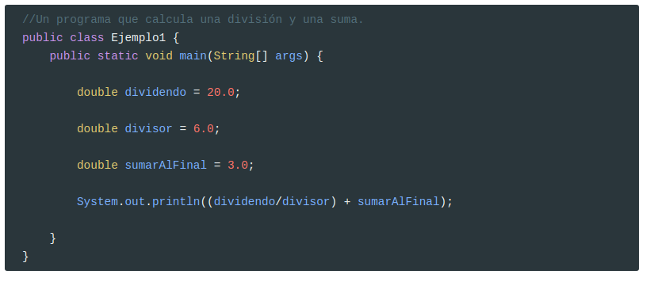

## 2 Un programa que calcula una división y una suma \(enteros\).

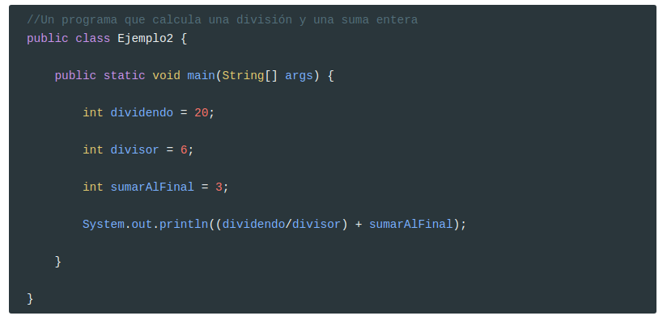


> **Tipos de datos en java**
>
> [http://rinconjava.com/tipos-de-datos/](http://rinconjava.com/tipos-de-datos/)

## 3 Un programa que calcula y muestra el área de un cuadrado de lado 5

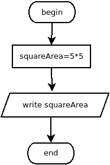

## 4 Un programa que calcula y muestra el área de un cuadrado cuyo lado se introduce por pantalla

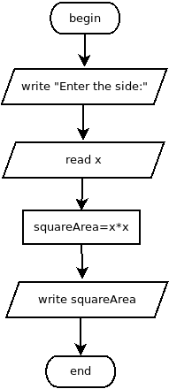

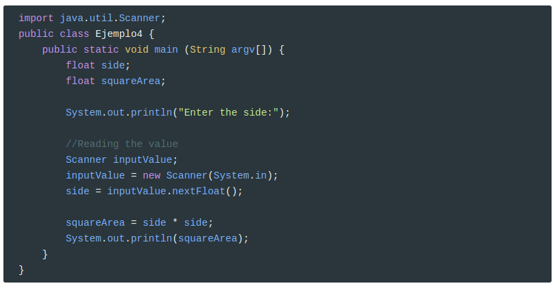


> **Importar librerías**
>
> [https://docs.oracle.com/javase/8/docs/api/java/util/Scanner.html](https://docs.oracle.com/javase/8/docs/api/java/util/Scanner.html)

## 5 Un programa que lea dos números enteros y muestre el resultado de sumarlos, restarlos, multiplicarlos y dividirlos

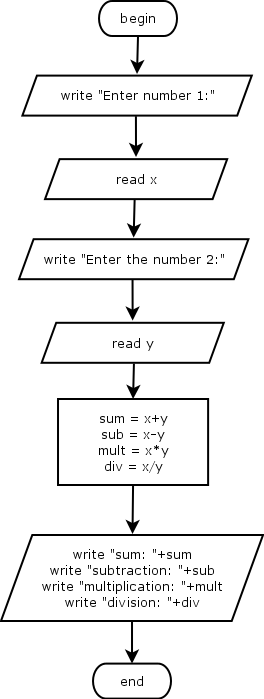

## 6 Un programa que pida el radio de una circunferencia y muestre su área y su perímetro

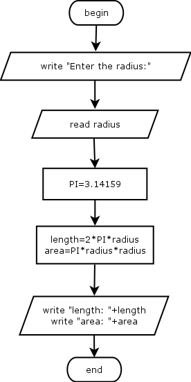

```java
//Nota. Para definir el valor de PI usad 
final double PI = 3.14159;
```

>  **Definir constantes en java**
>
> [http://lineadecodigo.com/java/constantes-en-java/](http://lineadecodigo.com/java/constantes-en-java/)

## 7 Un programa que pida el precio real de un producto, el precio rebajado y muestre el descuento realizado

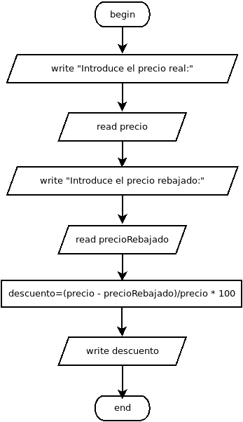

> ### Estructuras condicionales \(if\)
>
> La estructura condicional más simple es el if, se evalúa una condición y en caso de que se cumpla se ejecuta el contenido entre las llaves {} o en caso de que se omitan se ejecuta el código hasta el primer “;” por lo tanto si no se usan los {} la condición aplica solo a la siguiente instrucción al if.
>
> ```java
> public static void main(String[] args) {
> 
>     ......
>     if (edad >= 18){
>         System.out.println("Mayor de edad");
>     }
>     .....
> }
> ```

## 

## 8 Realiza un programa que pida la edad al usuario y muestre un mensaje si es mayor de edad

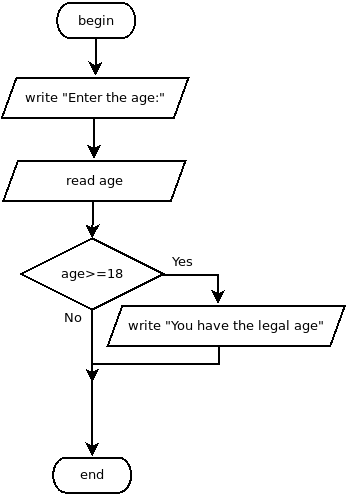

> ### Estructuras condicionales \(if - else\)
>
> En este caso, si no se cumple la condición del if, ejecuta el código definido en el else
>
> ```java
> public static void main(String[] args) {
> 
>     ......
>     if (edad >= 18){
>         System.out.println("Mayor de edad");
>     }else{
>         System.out.println("Menor de edad");
>     }
>     .....
> }
> ```

## 

## 9 Igual que el anterior pero que también muestre un mensaje si es menor de edad

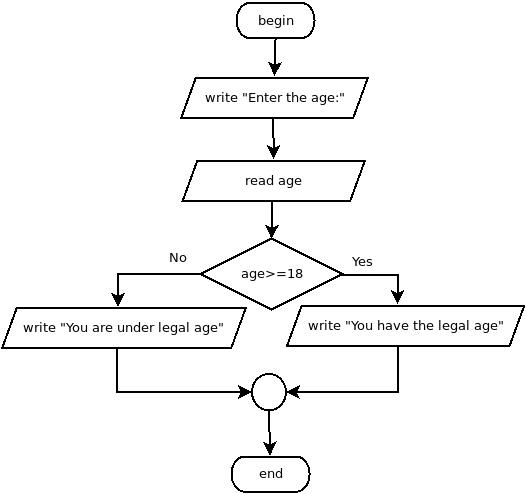

## 10 Diseña un algoritmo que lea un valor y muestre si es positivo o negativo \(0 es positivo\)

## 11 Diseña un algoritmo que lea dos valores y los muestre en orden ascendente.

## 12 Diseña un algoritmo que lea dos valores y muestre el más grande de ellos.

## 13 Realiza un programa que lea dos valores y los orden ascende o descentemente según elija el usuario.

## 14 Diseña un algoritmo que lea un valor numérico entero correspondiente a la nota de un examen y muestre su valor en letra:

de 0 a 3 Muy Deficiente.

de 3 a 5 Insuficiente.

de 5 a 6 Suficiente.

de 6 a 7 Bien

de 7 a 9 Notable

de 9 a 10 Sobresaliente

# Estructuras de decisión múltiple

Hay momentos en los que desea comprobar una serie de condiciones y ejecutar código diferente dependiendo de la condición.

Una forma de hacerlo es con la lógica if / else, como el siguiente ejemplo:

```java
int x = 1;

int y = 2;

if (UN_ENTERO == x){

//HACER ALGO

}else if (UN_ENTERO == y){

//HACER OTRA COSA

}else{

//CONDICIÓN POR DEFECTO

}
```

Esto funciona, sin embargo existe otra estructura que nos permite hacer lo mismo. Las sentencias `switch` permiten al programador ejecutar ciertos bloques de código dependiendo de condiciones exclusivas. El siguiente ejemplo muestra cómo se puede usar una sentencia `switch`:

```java
int x = 1;
int y = 2;

switch (UN_ENTERO o un String o un char)
{
   case x:
      //HACER ALGO;
      break;

   case y: 
      //HACER OTRA COSA 
      break;

   default:
      //CONDICIÓN POR DEFECTO
      break;
}
```

Hay que hacer notar que la condición swith sólo admite un char o un entero  
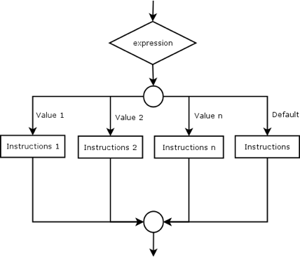

## 15 realiza un programa que lea un número entero del 1 al 10 y que muestre su valor en letra:

## 16 Realiza un programa que lea dos números enteros y dependiendo de la operación que indique el usuario \(+, -, \* , /\) muestre el resultado

>   Para leer un carácter con el objeto Scanner, usad el siguiente código
>
> ```java
>  char op = '';
>  String cadena; 
>  //Reading the value
>  Scanner inputValue;
>  Scanner reader = new Scanner(System.in);
>  cadena = reader.next();
>
>  op = cadena.charAt(0);
> ```


## 17 Realiza un programa que pida al usuario un mes e imprima el número de días que tiene.

```java
switch (mes){
    case 1:
    case 3:
        System.out.print("Tiene 31 días : ");
        break;
    case 2:
            .....
```

## 18 Diseña un algoritmo que recibe horas, minutos y segundos y muestra horas, minutos y segundos resultantes de la adición de un segundo.

## 19 Diseña un algoritmo que calcule el salario neto de un trabajador en función del número de horas de trabajo y los impuestos según las siguientes reglas:

* Las primeras 35 horas se pagan al precio normal por hora
* Las horas que exceden esas 35 horas se pagan 1,5 veces el precio normal.

  Las tasas impositivas son:

* Los primeros 500 € son libres de impuestos.

* los próximos 400 € tienen un impuesto del 25%

* Y el resto una tasa de impuestos del 45%.

Los datos de entrada son:

* € precio por hora
* número de horas.

Datos resultantes:

* Pago bruto
* Salario neto
* Impuestos

## 20 Precio final

Un cierto comercio hace un descuento dependiendo del precio de cada producto.  
Si el precio es inferior a 6 euros no hay descuento. Si es mayor o igual a 6 euros  
y menos de 60 €, se aplica un 5% de descuento, y si es mayor o igual a 60 € se aplica  
un 10% de descuento. Diseña el algoritmo para calcular el precio final.

## 21 Año bisiesto

Diseña un algoritmo que lea un año como dato de entrada y que muestre si es un año bisiesto o no. Todos los múltiplos de 4, excepto los que son múltiples de 100 y no de 400 son años bisiestos.  
\(Ej. Años bisiestos: 1600, 2000, 2400. No años bisiestos: 1700, 1800, 1900 ..\)

# Estructuras Iterativas \(loops\)

Las estructuras iterativas alteran el flujo normal de ejecución de un algoritmo, haciendo posible que un bloque de acciones o instrucciones se ejecuten un cierto número de veces, dependiendo del cumplimiento de una condición. Veremos 3 tipos de iteraciones:

* While
* Until
* For 

## While

Un bloque de acciones se ejecuta mientras una condición se evalúa como verdadera. La condición se evalúa siempre antes de entrar en el bucle, lo que hace posible que el bloque de acciones nunca se ejecutan si la condición se evalúa como falsa al principio.  
A veces,  no sabemos de antemano el número de veces que se ejecutará el bucle.  
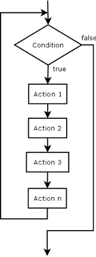

```java
i = 0;
while (i<10) {
    num = inputValue.nextInt();
    if (num>=0) {
        positives = positives + 1;
    }
    i = i + 1;
}
```

## Until

Se ejecuta un bloque de acciones hasta que una condición se evalúa como verdadera. La condición se evalúa siempre al final del bucle, lo que hace que el bloque de acciones se ejecutan al menos una vez.  
A veces, no sabemos de antemano el número de veces que se ejecutará el bucle.  
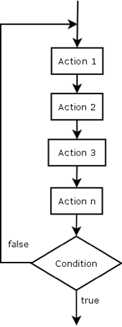

```java
i = 0;
do  {
    num = inputValue.nextInt();
    if (num>=0) {
        positives = positives + 1;
    }
    i = i + 1;
}while (i<10)
```

## For

En este tipo de bucle el número de veces que el bloque de instrucciones será ejecutado se conoce de antemano. Es un caso particular de una estructura de While.

* A una variable llamada contador se le asigna un valor inicial.
* La condición se evalúa utilizando ese contador como: contador &lt;= valor\_final
* En cada iteración la variable del contador se incrementa por un valor fijo \(incremento\).
  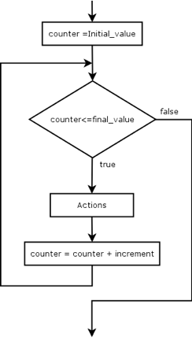

```java+theme:dark+lineNumbers:true
for (int i=0; i<10; i++) {
    num = inputValue.nextInt();
    if (num>=0) {
        positives = positives + 1;
    }
}
```

## 22 Números positivos

Escribe un programa que pida al usuario 10 números y que muestre cuántos son positivos

## 23 Números positivos II

Escribe un programa que pida al usuario n números y que muestre cuántos son positivos \(para acabar el programa, el usuario debe introducir el número 0\)

## 24 Nota media 

Diseña un algoritmo que lea un conjunto de notas del teclado hasta que se introduzca  -1 y muestre la nota media y si había un 10 o no.  
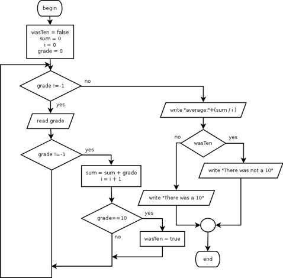

## 25 Factorial

Diseña un programa que calcule el factorial de un número

## 26 Tabla de multiplicar

Escribe un programa que lea un número y escriba su tabla de multiplicación

## 27 Impresión de números I

Diseña un algoritmo que lea un número n e imprima esto:  
1  
1 2  
1 2 3  
...  
1 2 3 4 5 ... n

## 28 Números primos

Escribe un programa que muestre si un número es primo o no.  
Los números primos tienen la siguiente característica: un número primo es solamente divisible por sí mismo y por la unidad, por tanto, un número primo no puede ser par excepto el 2. Para saber si un número impar es primo, dividimos dicho número por todos los números impares comprendidos entre 3 y la mitad de dicho número. Por ejemplo, para saber si 13 es un número primo basta dividirlo por 3, y 5. Para saber si 25 es número primo se divide entre 3, 5, 7, 9, y 11. Si el resto de la división \(operación módulo %\) es cero, el número no es primo.

## 29 Números primos II

Realiza un programa que imprima todos los números primos entre 3 y 100

## 30 Palíndromo

Realiza un programa que averigüe si una palabra o frase es palíndroma. Para averiguar el número de caracteres de una cadena se usa el método `length()`.

# Arrays

[http://www.sc.ehu.es/sbweb/fisica/cursoJava/fundamentos/clases1/arays.htm](http://www.sc.ehu.es/sbweb/fisica/cursoJava/fundamentos/clases1/arays.htm)

[https://docs.oracle.com/javase/tutorial/java/nutsandbolts/arrays.html](https://docs.oracle.com/javase/tutorial/java/nutsandbolts/arrays.html)

```java
class ArrayDemo {
    public static void main(String[] args) {
        // declares an array of integers
        int[] anArray;

        // allocates memory for 10 integers
        anArray = new int[10];

        // initialize first element
        anArray[0] = 100;
        // initialize second element
        anArray[1] = 200;
        // and so forth
        anArray[2] = 300;
        anArray[3] = 400;
        anArray[4] = 500;
        anArray[5] = 600;
        anArray[6] = 700;
        anArray[7] = 800;
        anArray[8] = 900;
        anArray[9] = 1000;

        System.out.println("Element at index 0: "
                           + anArray[0]);
        System.out.println("Element at index 1: "
                           + anArray[1]);
        System.out.println("Element at index 2: "
                           + anArray[2]);
        System.out.println("Element at index 3: "
                           + anArray[3]);
        System.out.println("Element at index 4: "
                           + anArray[4]);
        System.out.println("Element at index 5: "
                           + anArray[5]);
        System.out.println("Element at index 6: "
                           + anArray[6]);
        System.out.println("Element at index 7: "
                           + anArray[7]);
        System.out.println("Element at index 8: "
                           + anArray[8]);
        System.out.println("Element at index 9: "
                           + anArray[9]);
    }
}
```

## 31 Imprimir array

A partir del código anterior, imprime el contenido del array mediante un bucle for

## 32 Orden inverso

Realiza un programa que lea 10 números y los muestre en orden inverso

## 33 DNI

Realiza un programa que lea un DNI sin letra y calcula la misma \(usad un array para almacenar las letras\)  
En este [enlace](http://www.interior.gob.es/web/servicios-al-ciudadano/dni/calculo-del-digito-de-control-del-nif-nie) se explica cómo se calcula la letra del DNI.

## 34 NIE

Realiza un programa que calcule la letra de un NIE

# For mejorado para arrays

Una forma de hacer los bucles más compactos para arrays es usar enhanced for

```java
class EnhancedForDemo {
public static void main(String[] args){
    int[] numbers = {1,2,3,4,5,6,7,8,9,10};
    for (int item : numbers) {
        System.out.println("Count is: " + item);
    }
    }
}
```

## 35 Suma y media de un arrary

Realiza el programa 24 con arrays

## 36 Máximo

Realiza un programa que pida diez números e imprima el mayor

## 37 Máximo y mínimo

Realiza un programa que pida diez números e imprima el mayor y el menor

## 38 Contar vocales

Realiza un programa que lea una cadena de texto e imprima cuantas vocales no acentuadas contiene.

## 39 Divisores

Realiza un programa que pida un número natural y escriba sus divisores

## 40 Fibonacci

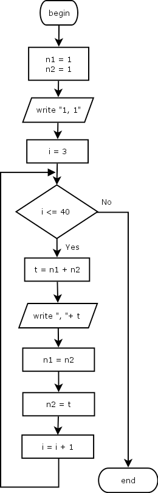

Diseña un programa que muestre los primeros 40 términos de la serie de [Fibonacci](https://es.wikipedia.org/wiki/Sucesión_de_Fibonacci)
Este programa utiliza una técnica usada mucho en programación que se denomina _swap_ y que consiste en intercambiar el valor de dos variables usando una variable auxiliar. 

## 41 Número Áureo

Modifica el programa anterior para que muestre la relación \(división\) entre el valor n y el \(n - 1\) de la serie de Fibonacci. Esta es una manera de obtener una aproximación al [Número Áureo](https://es.wikipedia.org/wiki/Número_áureo).

## 42 Sumas sucesivas 
Realiza un programa que calcule la multiplicación de dos números usando el método de las sumas sucesivas
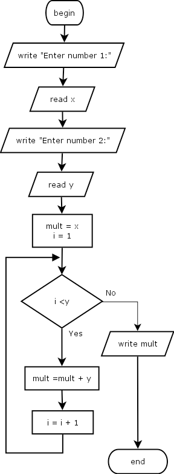

## 43 Restas sucesivas
Realiza un programa que calcule el resto de una división usando el método de las restas sucesivas.
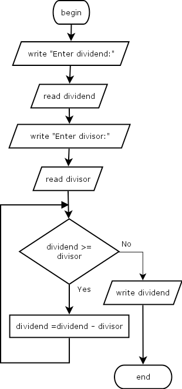

## 44 Binario a decimal
Realiza un programa que lea una cadena de números binarios y calcule su valor en decimal

## 45 Decimal a binario
Realiza un programa que lea un número entero decimal (máximo 255) e imprima su valor en binario
## 46 Juego Adivina un número 
Diseña un algoritmo para jugar a "adivinar un número". El algoritmo generará un número _aleatorio_ entre 1 y 100, que llamaremos el número secreto, y le pedirá al jugador que introduzca un número hasta que gane o un -1 para rendirse:

* Si el número es igual al número secreto, mostrará "Has Ganado" en la pantalla y terminará
* Si el número introducido es mayor que el número secreto, mostrará "El número secreto es más pequeño" y le pedirá que introduzca otro.
* Si el número introducido es menor que el número secreto, mostrará "El número secreto es más grande" y le pedirá que introduzca otro.
* Si el número introducido es -1, mostrará "Se rinde" y terminará

Para generar un número aleatorio usa este código.
```java
import java.util.Random;
....
    Random aleatorio = new Random(System.currentTimeMillis());
    // Producir nuevo int aleatorio entre 0 y 99
    int intAleatorio = aleatorio.nextInt(100);

```
## 47 Marco con cadenas
Escribe una función que recoja una lista de cinco cadenas, una por línea, y las imprima en un marco rectangular. Por ejemplo, la lista ["Hola", "esto", "es", "un", "marco"]

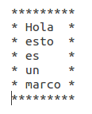

```java
import java.util.Scanner;
class Ejemplo48 {
	public static void main(String[] args){
		String[] cadenas = new String[5];
		System.out.println("Introduce 5 cadenas de texto:");
		Scanner inputValue;
        inputValue=new Scanner(System.in);
		
		for (int i = 0; i < 5; i++){
			cadenas[i] = inputValue.next();
		}
		
		....

	}
}
```

